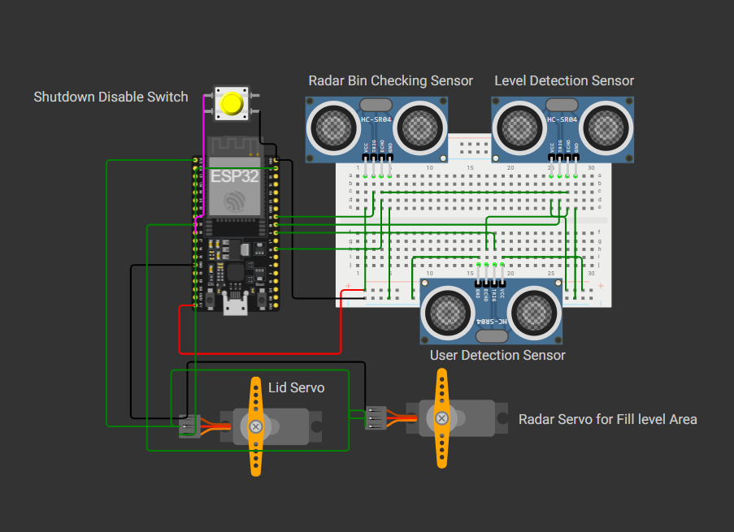
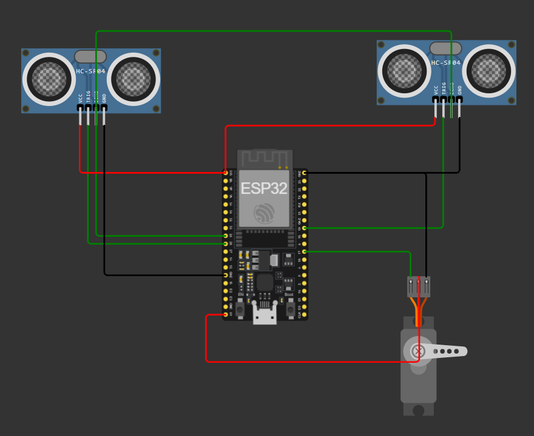
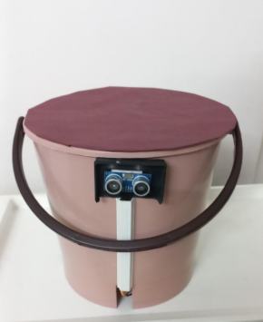
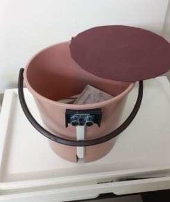
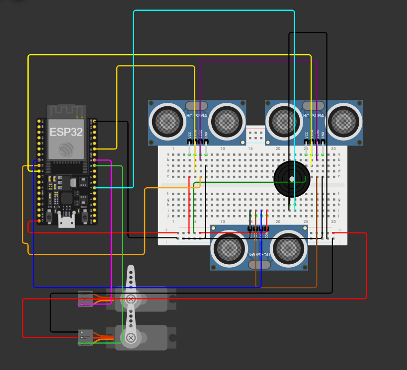

<div align="center">

# 🗑️ Smart Dustbin Project

### *From a Semester Mini Project to an Intelligent Waste Monitoring System*

**Embedded C++ • ESP32 • ESP8266 • Arduino IDE • Wokwi • Blynk • ThingSpeak • Twilio**

[](https://github.com/Suyash108SushantamanDurgadas/Smart-Dustbin-Project-MPR1B/stargazers)
[](https://github.com/Suyash108SushantamanDurgadas/Smart-Dustbin-Project-MPR1B/network)
[](https://github.com/Suyash108SushantamanDurgadas/Smart-Dustbin-Project-MPR1B/issues)
[](LICENSE)



> **A modular intelligent waste monitoring system featuring touchless automation, IoT connectivity, radar-style surface scanning, and area-based fill estimation.**

</div>

---

# 📖 Overview

This repository documents the complete evolution of our **Semester 4 Mini Project**.

What began as a simple automatic dustbin gradually evolved into a modular intelligent waste monitoring system through multiple iterations, each solving a limitation of the previous version.

Instead of keeping only the final implementation, this repository preserves the entire engineering journey—from the first working prototype to advanced simulation and algorithm development.

---

# 🚀 Project Evolution

| Version | Platform | Major Contribution |
|----------|----------|--------------------|
| 🟢 Version 1 | ESP32 Hardware | Basic Smart Dustbin (Semester 4 MPR) |
| 🔵 Version 2 | ESP8266 Hardware | IoT Integration (Blynk + ThingSpeak + Twilio) |
| 🟣 Version 3 | Wokwi Simulation | Object-Oriented Architecture & Radar Scanning |
| 🔴 Version 4 | Wokwi Simulation | Intelligent Area-Based Fill Estimation |

---

# 🧠 Engineering Evolution

```text
Version 1
│
├── Automatic Lid
├── Fill Detection
└── Physical Prototype
        │
        ▼
Version 2
│
├── Wi-Fi Connectivity
├── Blynk Dashboard
├── ThingSpeak
└── Twilio SMS
        │
        ▼
Version 3
│
├── Object-Oriented Design
├── Three Ultrasonic Sensors
├── Rotating Scanner
└── Radar-style Mapping
        │
        ▼
Version 4
│
├── Finite State Machine
├── Area-based Fill Estimation
├── Sector Averaging
└── Intelligent Waste Analysis
```

---

# ✨ Features

## 🤖 Automation

- Touchless lid opening
- Automatic lid closing
- Servo controlled mechanism
- Overflow prevention

---

## 📡 IoT

- Blynk Dashboard
- ThingSpeak Cloud Analytics
- Twilio SMS Alerts
- Remote Monitoring

---

## 🧠 Intelligent Algorithms

- Object-Oriented Design
- Finite State Machine
- Radar-style Surface Scanning
- Area-based Fill Estimation
- Sector Averaging
- Noise Reduction

---

## 💻 Simulation

- Complete Wokwi Simulation
- Hardware-independent testing
- Easy experimentation

---

# 📸 Project Gallery

## Version 1



---

## Version 2





---

## Version 3



---

## Version 4


---

# ⚙ Technologies Used

## Hardware

- ESP32
- ESP8266
- HC-SR04 Ultrasonic Sensor
- Servo Motors
- Push Button
- Buzzer

---

## Software

- Arduino IDE
- Embedded C++
- ESP32Servo
- Servo Library

---

## Cloud

- Blynk
- ThingSpeak
- Twilio

---

## Simulation

- Wokwi

---

# 📂 Repository Structure

```
Smart-Dustbin-Project-MPR1B
│
├── Version-1_MPR_Basic
├── Version-2_IoT
├── Version-3_Wokwi_OOP
├── Version-4_Intelligent_Waste_Analysis
│
├── docs
│   ├── Images
│   ├── Project_Report_MPR.pdf
│   └── Presentation.pdf
│
├── LICENSE
├── CHANGELOG.md
├── CONTRIBUTING.md
└── README.md
```

---

# 📊 Version Comparison

| Feature | V1 | V2 | V3 | V4 |
|----------|:--:|:--:|:--:|:--:|
| Touchless Lid | ✅ | ✅ | ✅ | ✅ |
| Fill Detection | ✅ | ✅ | ✅ | ✅ |
| IoT Dashboard | ❌ | ✅ | ❌ | ❌ |
| ThingSpeak | ❌ | ✅ | ❌ | ❌ |
| SMS Alerts | ❌ | ✅ | ❌ | ❌ |
| OOP Design | ❌ | ❌ | ✅ | ✅ |
| Radar Scanning | ❌ | ❌ | ✅ | ✅ |
| Finite State Machine | ❌ | ❌ | ❌ | ✅ |
| Area Estimation | ❌ | ❌ | Approximate | Accurate |

---

# 🚀 Getting Started

Clone the repository

```bash
git clone https://github.com/Suyash108SushantamanDurgadas/Smart-Dustbin-Project-MPR1B.git
```

Open the desired version inside **Arduino IDE**.

Install the required libraries.

Select the appropriate board

- ESP32
- ESP8266

Compile and upload.

---

# 📚 Documentation

The repository includes

- 📄 Semester 4 Project Report
- 📊 Project Presentation
- 📷 Hardware Images
- 🧩 Wokwi Simulations

---

# 👥 Team

- **Suyash Subodh Shirsat**
- **Devesh Vikrant Shelatkar**
- **Priyanka Amit Vaidya**

---

# 🌱 Future Scope

- AI-based waste classification
- Camera-assisted segregation
- MQTT integration
- LoRa communication
- Solar-powered deployment
- Smart city integration
- Predictive waste collection

---

# 🤝 Contributing

Contributions are welcome.

If you'd like to improve the project,

1. Fork the repository
2. Create a new branch
3. Commit your changes
4. Push the branch
5. Open a Pull Request

---

# 📜 License

This project is licensed under the **MIT License**.

See the **LICENSE** file for details.

---

<div align="center">

### ⭐ If you found this project interesting, consider giving it a star!

*"Engineering is rarely about building the perfect system on the first try. It's about continuously improving each iteration."*

</div>
